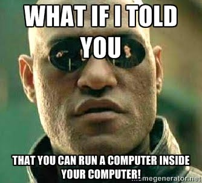

# Virtualization (blog)

Virtualization is the ability to run a computer inside another computer.  From a security perspective, there are many benefits of doing this, most notable the ability to sandbox, or isolate, a system that may be vulnerable or compromised.  CyberPatriot uses virtualization in the competitions so that we can compete on compromised systems with out affecting our real systems.

To start with virtualization, you need an application that acts as a hypervisor, or a bridge between the virtual computer resources and the physical resources.  The 2 main applications are VMWare and VirtualBox.

VMWare Player is a free solution that will allow the running of pre-built virtual machines, called guests, on your computer, called the host.  The CyberPatriot competition images are built for VMWare Player.

* Download and install VMWare Workstation Player from https://www.vmware.com/products/player/playerpro-evaluation.html
* Find an image from a website such as OS Boxes to download - http://www.osboxes.org/vmware-images/
* Launch VMWare Player and open the OS image that was downloaded.
* Virtually boot your new computer in a computer.

What you should see is a window that opens, which looks like the desktop of your guest.  You can browse the web, run applications, and even may be able to play some games on the guest.  And when you are done, the guest can be shutdown, like your desktop/laptop can be shutdown.

Many virtual machines that are offered for free on the internet are Linux, or other free operating systems such as Android.  Windows will also run in virtual machines, but due to licensing of the OS, they are not available for free download.

Some uses of virtualization include:

* Test a new operating system or application.
* Run an application that you do not know how it affects your main computer.
* Run an application without messing up your main computer.
* Run an application that requires a special configuration.
* Learn how to install an operating system.

One downside to virtualization is that performance of the guest will be decreased due to not having native access to the hosts hardware.

To give virtualization a try, you can follow the example directions on the US CyberPatriot web site at http://uscyberpatriot.org/competition/training-materials/linux.

