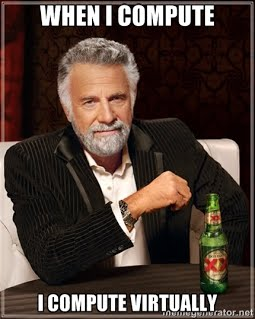

# Getting Started with VM (blog)

If you have a computer, with a 64-bit processor in it, and at least 2 GB of RAM, you should be able to work with a CyberPatriot image.

To check to see if you have a 64-bit computer and memory, you can do the following:

* Open System by clicking the Start button Picture of the Start button, right-clicking Computer, and then clicking Properties.
* In the System section, you can view the system type to see if it is 64-bit or 32-bit.
* In the System section, next to Installed memory (RAM), you can see the amount of RAM your computer has.

To be able to play with a CyberPatriot image, start out by downloading and Installing the VMWare Player software.  This software is considered a hypervisor, and will allow the virtual image to act like a virtual computer.

Once you have the hypervisor installed, you need an image to be able to work with.  Due to licensing requirements, we will use a CyberPatriot Ubuntu practice image.  Visit the page at https://www.uscyberpatriot.org/competition/training-materials/practice-images, and download one of the images near the bottom of the page.  Take note of the username and password on the page.

After the practice image is downloaded, you will have to unzip the image by right clicking on the icon, select 'Extract all..', and follow the prompts to extract the zip file.

Now the fun part, as illustrated in the last slide at https://s3.amazonaws.com/cpvii/Training+materials/Unit+Three+-+Computer+Basics+and+Virtual+Machines.pdf:

1. Start your newly installed VMWare Player software
- Click “Open a Virtual Machine”
- Browse for and open the .vmx file in the image folder you downloaded
- Click “Play virtual machine”
- Select “I copied it”
- Click “OK” on Removable Devices pop-up

You will now have a virtual linux computer that you can play with.  There are virtual power buttons, virtual ctrl-alt-del, and virtual shutdown processes.  One of the benefits of using a virtual computer is that you can play with it, and if you break something in the virtual computer, all you have to do is re-unzip the image, and restart.

This is a very high level overview of starting a virtual machine, but with some playing, you should be able to play with virtualization and ubuntu.

One last thing to note.... I consider this playing, and not working.  It is fun when you start playing with virtual machines and find out what you can do on a computer while you have a safety net of a restore that you can fall on to.

