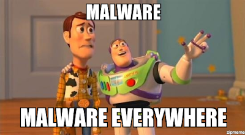

# Malware Tools (blog)

With all of the talk of cloud computing, smart phones and tables, and internet of things, desktop malware scanning started fading into the trees.  Yet with a current headline, malware scanning is as important as ever, and will spread to to all the things.

[Study: Twelve new malware strains created per minute during first half of 2015](http://www.scmagazine.com/g-data-software-issues-biannual-report/article/448883/)

There are a number of different malware types out there, and different tools can address some better than others.  The tools we are focusing on for this article are for anti-virus, spyware/crapware, and root kits.

One of the staples of malware is viruses.  A virus is distinguished by a piece of malicious software that will attach itself to other files and executables, or simulate valid executable, and will be activated when the file is executed.  Viruses can propagate through worms, infected removable media, or social engineering attacks like phishing.  To mitigate virus threats, it is best to have an up-to-date virus scanning software on your system.  Make sure that only one is installed and active, as multiple virus scanners can actually hinder your system.  Some product links below:

* [Kaspersky Labs](http://usa.kaspersky.com/)
* [Norton AntiVirus](http://us.norton.com/antivirus/)
* [TrendMicro Antivirus + Security](http://www.trendmicro.com/us/home/products/software/antivirus-plus-security/)
* [McAfee AntiVirus Basic](https://www.mcafee.com/consumer/en-us/store/m0/catalog/mavb_511/mcafee-antivirus-basic.html)

If you want to test if you have some antivirus software, you can (try to) download a test virus file from EICAR: [EICAR Test File](http://www.eicar.org/86-0-Intended-use.html)

The majority of items tend to be less malicious, and considered spyware or crapware.  These tend to be registry settings, potentially unwanted programs, cookies, or other nuggets of data to track what you do and slow down your system.  For these type of malware, the defacto standard scanner is MalwareBytes.  If MalwareBytes does not take care of it, Hijack This can be used to look deeper to see if you can determine what may be cause an issue.  With these type of scanners, you want to scan, clean, repeat until the unwanted items are gone.

* [MalwareBytes](https://www.malwarebytes.org/mwb-download/)
* [HiJack This](http://sourceforge.net/projects/hjt/)

Finally, there can be a form of malware that is intelligent enough to hide itself from most other scanners.  These are call Root Kits, and can be particularly nasty and may require special tools to clean them off.

* [RootKit Buster](http://files.trendmicro.com/products/rootkitbuster/x64/RootkitBusterV5.0-1198x64.exe)

As we get more advanced, and start knowing what normal looks like on our computers, we can used the advanced tools below to dig deeper into our systems:

* [Sysinternals Process Explorer](https://technet.microsoft.com/en-us/sysinternals/bb896653)
* [Sysinternals TCP View](https://technet.microsoft.com/en-us/sysinternals/bb897437)

So, in an instance where a relative or acquaintance comes to you for malware help, I'd recommend the following process:

1. Remove any programs that are not required or look suspicious from Add/Remove Programs or Features in the Control Panel.  If you do not know what a program is, use your Google-Fu to find out what it is.
- Install, update, and run MalwareBytes to clean off the spyware and crapware settings.  Scan, clean, repeat until the majority of the items are gone.
- Update and scan the computer with the installed anti-virus software.  If one is not installed, install one.  If more than one is installed, remove the ones that are free or unlicensed (unless the free one is the main one.)  Scan, clean, repeat until the virus is gone.
- If a virus is identified but not cleaned, use your Google-Fu to find out more information on it.  Many times, there may be a special removal procedure that you can follow.
- If the system is still acting funny, there may be a root kit, in which you would require a root kit buster/killer to clean.
- Finally, booting off a rescue CD and scanning the system using something like the Kaspersky Rescue CD may be a solution.
- If nothing else, punt... through some up rights and into a lake. :)

