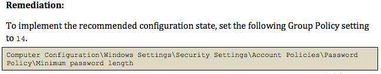

# What Does Secure Look Like (blog)

Ever wonder what secure looks like, or can be like, especially for people new to cyber security.  There are some organizations that attempt to standardize and guide people in what secure looks like.  One such organization that I'd like to point out is Center for Internet Security, and more focused on the documents they offer to help you secure a computer.

Lets look at securing Windows 7.  You can start by visiting the Benchmarks Download page and download the benchmark for your OS.  Each benchmark will provide a detailed list of items that can be done to secure a system, the reason why the item is considered for security, how to check the item, and how to fix the item.

An example from the Windows 7 Benchmark that we covered is password policy.  When I found minimum length of a password in the benchmark, it showed the following..

Farther down in the document, it gave the instructions on how to set the minimum password length to 14...

This gives the full path in the Group Policy tool to find the setting and update to the recommended value of 14.

As you would go through the document, many settings would be addressed.  Going through the full document on a competition image would be over kill, but having it available, and searching for key terms in the competition scenario may help direct you in what needs to be changed and how to change it.

The Windows 7 document is quite lengthy and complex, at 420 pages, yet does provide value to search for settings to secure and locations.  The Ubuntu 12.04 benchmarks tend to be a bit more straight forward, and weights in at only 160 pages.

I recommend that you familiarize yourself with the documents to use as a reference for competitions, or just to secure your home computer.
